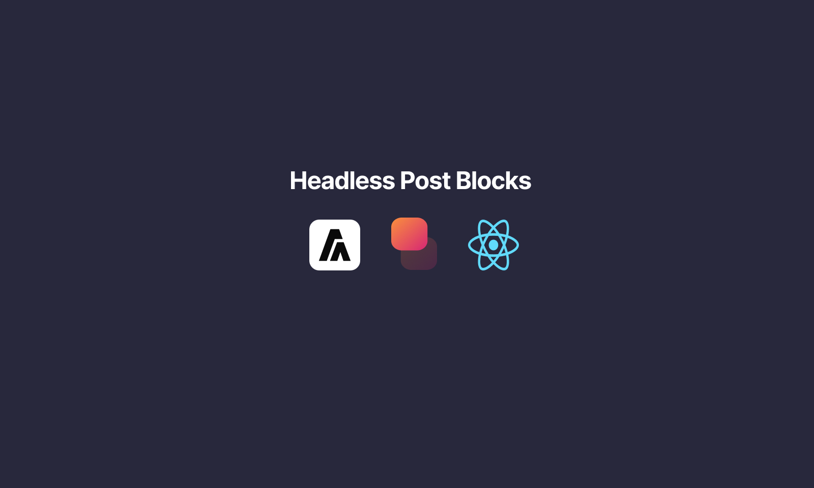

<!-- ReadMe inspiration From JavaScriptMastery -->

<div align="center">
  <br />
    <div style="border:1px solid red;border-radius:20px;">
      
    </div>
  
  <br />

  <h3 align="center">Headless Post Blocks</h3>

   <div align="center">
     Generate typeSafe components from WordPress Gutenberg blocks
    </div>
</div>

## 📋 <a name="table">Table of Contents</a>

1. 🤖 [Introduction](#introduction)
2. ⚙️ [Tech Stack](#tech-stack)
3. 🔋 [Features](#features)
4. 🤸 [Quick Start](#quick-start)

## <a name="introduction">🤖 Introduction</a>

Simple implementation to generate components from WordPress Gutenberg blocks

## <a name="tech-stack">⚙️ Tech Stack</a>

- Reactjs
- LazyBlocks
- Aceternity Ui

## <a name="quick-start">🤸 Quick Start</a>

Follow these steps to set up the project locally on your machine.

**Prerequisites**

Make sure you have the following installed on your machine:

- [Git](https://git-scm.com/)
- [Node.js](https://nodejs.org/en)
- [npm](https://www.npmjs.com/) (Node Package Manager)
- [Wordpress](https://localwp.com/)

**Cloning the Repository**

```bash
git clone https://github.com/islamBelabbes/react-headless-post-blocks.git
cd react-headless-post-blocks
```

**Installation**

Install the project dependencies using npm:

```bash
npm install
```

Upload the Wordpress Plugin

**Running the Project**

```bash
npm run dev
Run wordpress env with Local
```

Install LazyBlocks and create a block with the specific fields , and create a new post with the block
Open [http://localhost:3000](http://localhost:3000) in your browser to view the project.
